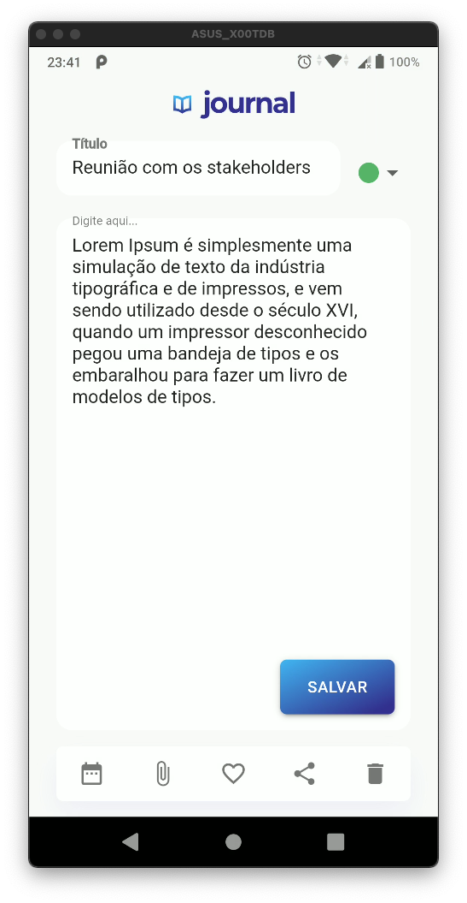

# LevelUP#4

O levelUP dessa semana consiste em dar sequencia ao nosso Notes!
Como vocês foram desafiados na última sexta a criar a tela de criação de notas, dessa vez será a tela de visualização de notas.

## Features

## Práticas

- Componentização
- Uso do setState
- Form / TextFormFields / Validation
- Navegação nomeada
- Customização de widgets básicos
- Criação de Controllers e Validators para implementação/apoio as regras de negócio 
- Passagem de parâmetros entre pages/rotas
- Uso do localstorage

## Packages 

- shared_preferences: ^2.0.5
- uuid: ^3.0.4
- flutter_staggered_grid_view: ^0.4.0
- intl: ^0.17.0
- animated_card: ^2.0.0
- flutter_svg: ^0.22.0

## Screenshots
 

  
   

  
   

  
   

